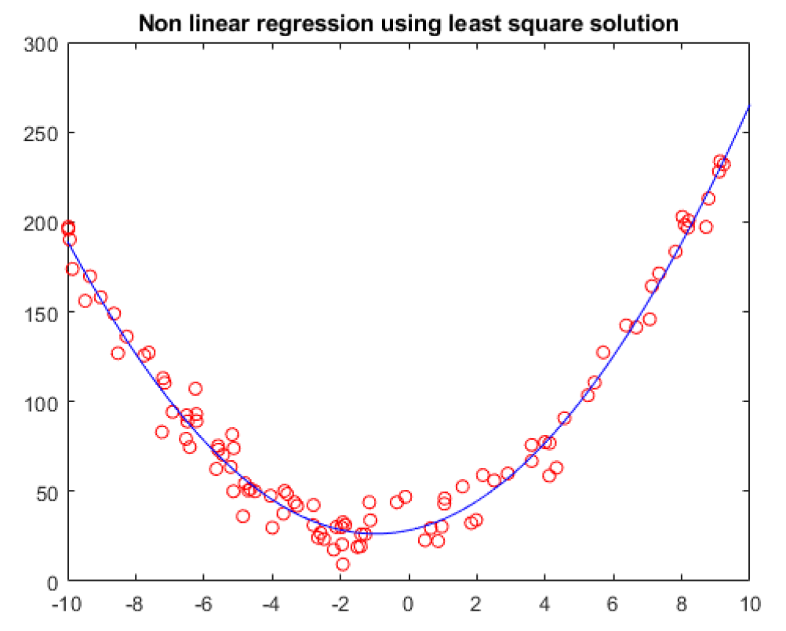
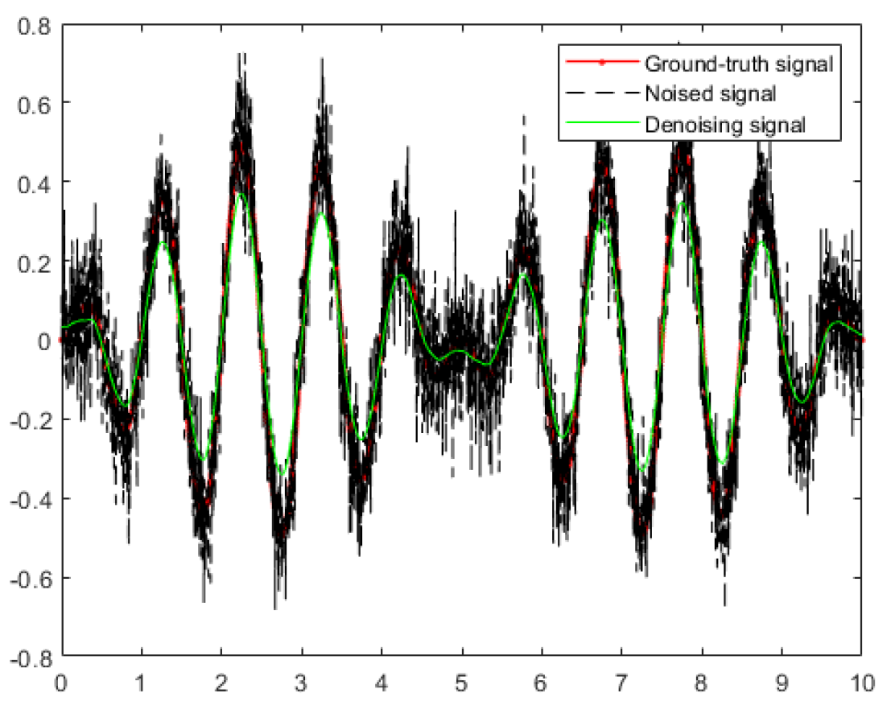
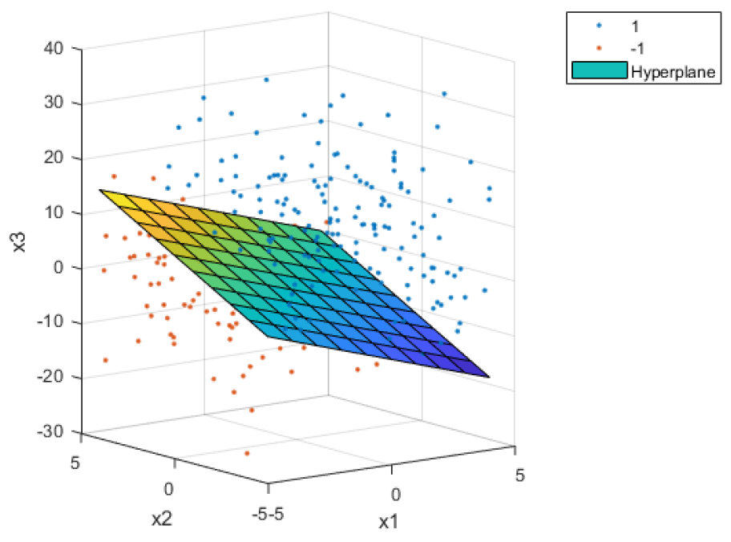
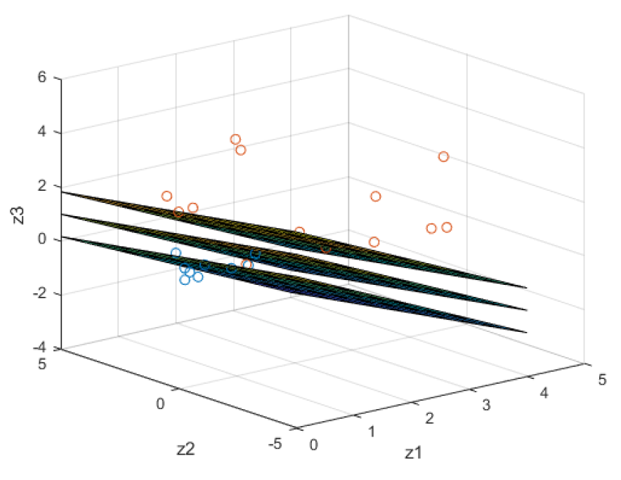
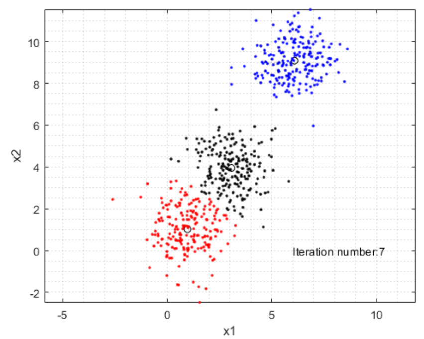
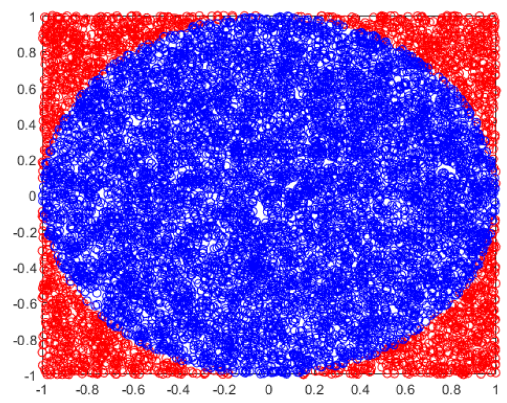
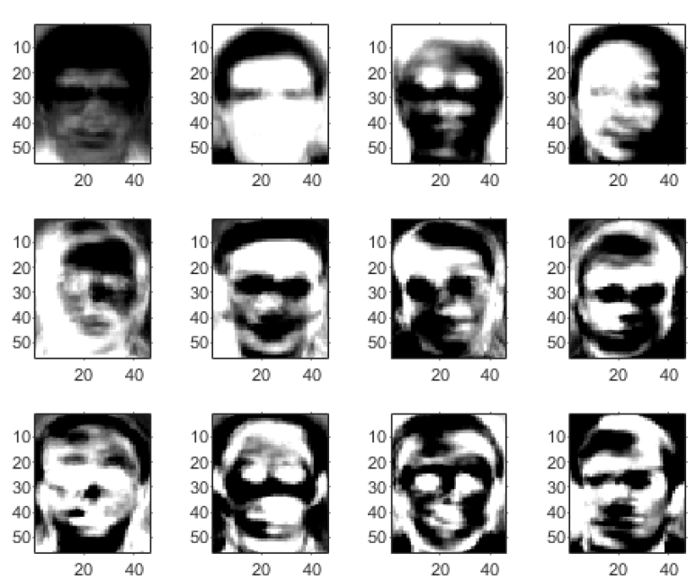
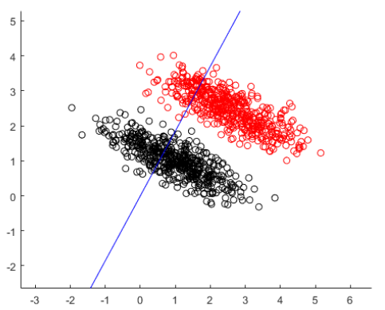
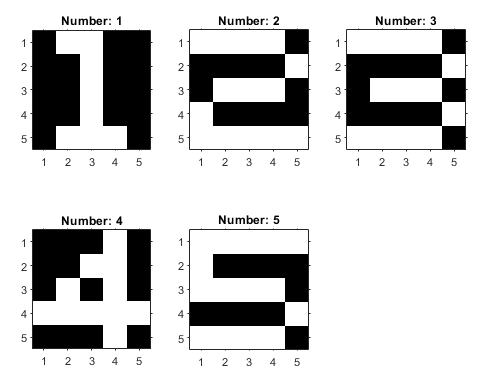

# Machine learning basics with MATLAB

Special thanks to **Prof. Sim** for your excellent guidance.
 
This course covered several problems related to machine learning, from optimization to neural networks.
I really enjoyed this course so I tried to summarize and visualize the results with animation as shown in the Matlab livelink file.

When I started to learn machine learning, I tried to jump directly into the "hot" keywords like neural network, cnn, rnn...
The more I study, however, the more I realized that I had to start from the very basic definition, and the most important: MATH.

Hopefully, these documents can help someone on the way self-studying machine learning. 

Cheers.

Dai Tran
## Course contents
#### Optimization problems
Using fmin and fmincon to solve the optimization problem.

Using gradient descent

#### Regression
Linear/ nonlinear regression 

Denoising signal

### Classification

### SVM

### k-means

### monte carlo simulation

### PCA

### FDA

### ANN

## Code explanation

In [Review](Review.mlx), I summarized the basics content of this course, as well as some solutions for weekly assignments.

Some helper functions like [backpropagation](backpropagation_num.m) [sigmoid](sigmoid_func.m) or [softmax](softmax_func.m) should stay in the same folder of the main source code.

 
