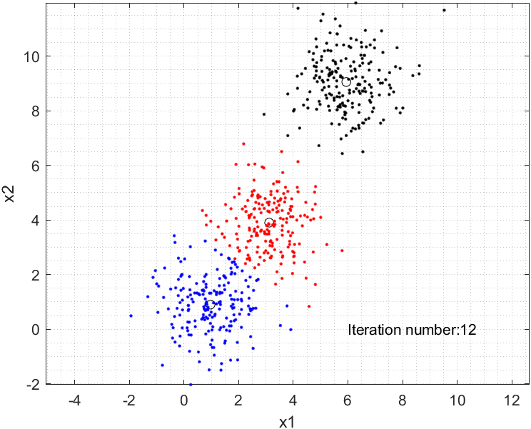

# Machine learning basics with MATLAB

This course covered several problems related to machine learning, from optimization to neural networks.
I really enjoyed this course so I tried to summarize and visualize the results with animation as shown in the Matlab livelink file.

When I started to learn machine learning, I tried to jump directly into the "hot" keywords like neural network, cnn, rnn...
The more I study, however, the more I realized that I had to start from the very basic definition, and the most important: MATH.

Hopefully, these documents can help someone on the way self-studying machine learning. 

Cheers.

Dai Tran

